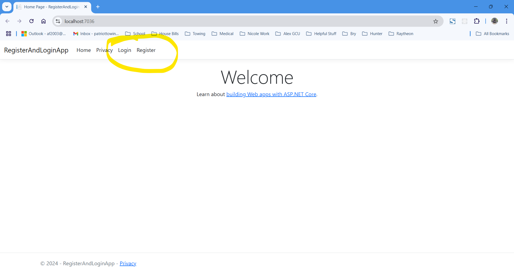
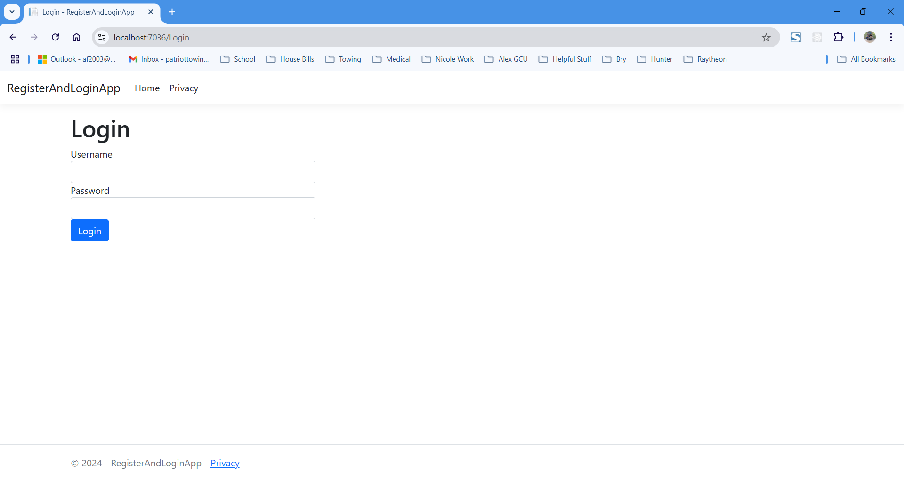
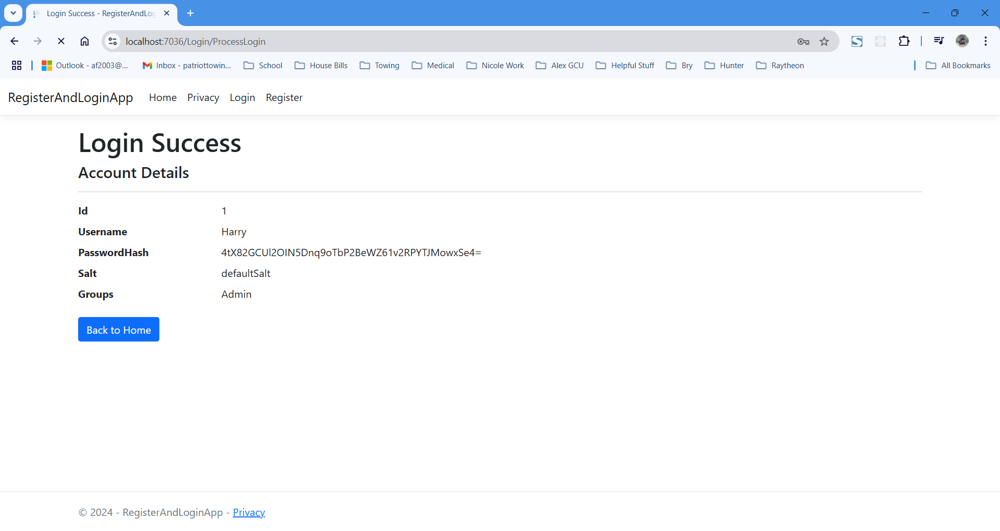
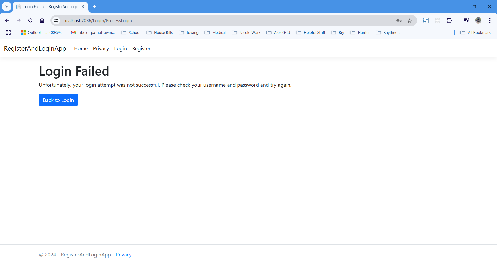
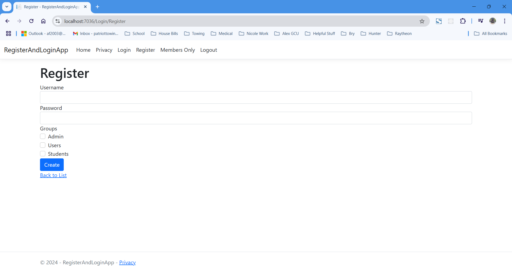
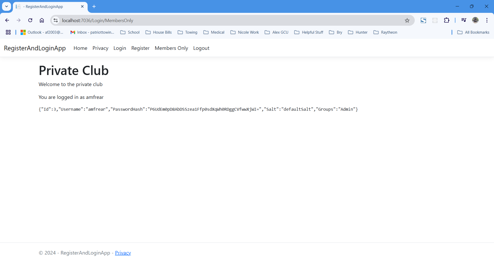

# CST-350 Activity 2 - Login and Registration System

## Cover Sheet
**Student Name:** Alex Frear  
**Date:** 10/28/2024  
**Program:** College of Science, Engineering, and Technology, Grand Canyon University  
**Course:** CST-350 Programming in C# III  
**Instructor:** Brandon Bass  

## Part 1: Login and Registration System Overview
- **Below are screenshots demonstrating the different steps and pages created as part of Activity 2, Part 1 - Building a Login and Registration System in ASP.NET Core.**

### 1. Home Page with Login and Register Links

*This screenshot shows the home page of the application with `Login` and `Register` links in the navigation bar, providing easy access to authentication features.*

### 2. Login Page

*This screenshot displays the login page, prompting the user to enter their `Username` and `Password` to access the system.*

### 3. Successful Login

*The screenshot shows a successful login attempt, displaying the user's account details, including `Username`, `PasswordHash`, `Salt`, and `Groups`.*

### 4. Login Failure

*This screenshot shows the login failure page, which appears when the user enters incorrect credentials. The message indicates that the login attempt was not successful and prompts the user to try again.*

## Summary of Key Concepts (Part 1)
In Part 1 of this activity, I developed a login and registration system in ASP.NET Core using the MVC pattern. Key concepts I covered include setting up the project structure, building user models, creating views for login and registration, implementing controllers, and integrating user management logic. I learned about the importance of hashing and salting passwords, used ASP.NET helper tags for simplifying form creation, and tested my application to ensure proper user authentication functionality.

---

## Part 2: User Registration and Members-Only Access
- **Below are screenshots demonstrating the different steps and pages created as part of Activity 2, Part 2 - Adding Registration and Members-Only Access to the System.**

### 5. Members Only Page Access by Existing User (Harry)

*This screenshot shows that the existing user `Harry` is also able to access the Members-Only page, with session data displayed for verification.*

### 6. Register Page

*This screenshot shows the registration page, where new users can create an account by providing a `Username`, `Password`, and selecting one or more `Groups` to belong to.*

### 7. New Registered User - Login Success

*The screenshot shows a successful login by a newly registered user, displaying the account details including `Username`, `PasswordHash`, `Salt`, and `Groups`.*

### 8. Members Only Page Access by New User

*This screenshot demonstrates that the newly registered user can successfully access the Members-Only page, showing the session data for verification.*

## Summary of Key Concepts (Part 2)
In Part 2 of this activity, I extended the login and registration system to include a user registration feature and restricted access to a Members-Only page. Key concepts I covered include creating a registration form, building a `RegisterViewModel` to handle user input, and adding new methods in the controller to process registration. I also introduced session management to maintain user state and ensure that only authenticated users can access restricted pages. The Members-Only page verifies session information before granting access, demonstrating effective use of action filters and session variables in ASP.NET Core. By completing Part 2, I learned how to add new users to the system, manage their authentication state, and restrict page access based on login status.