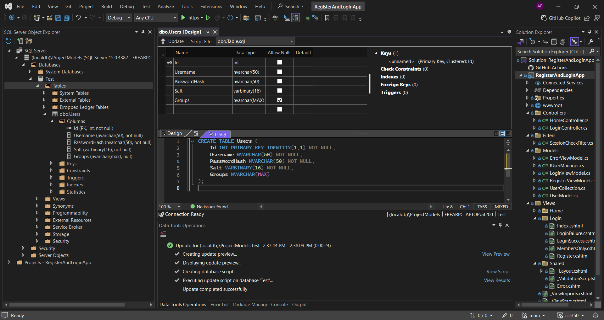
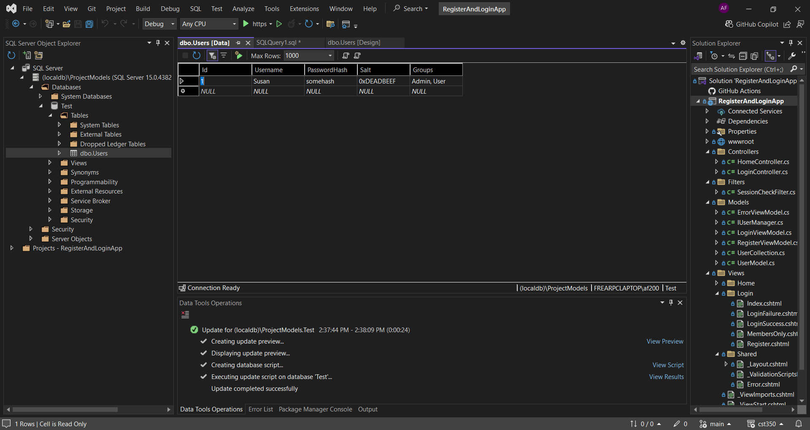
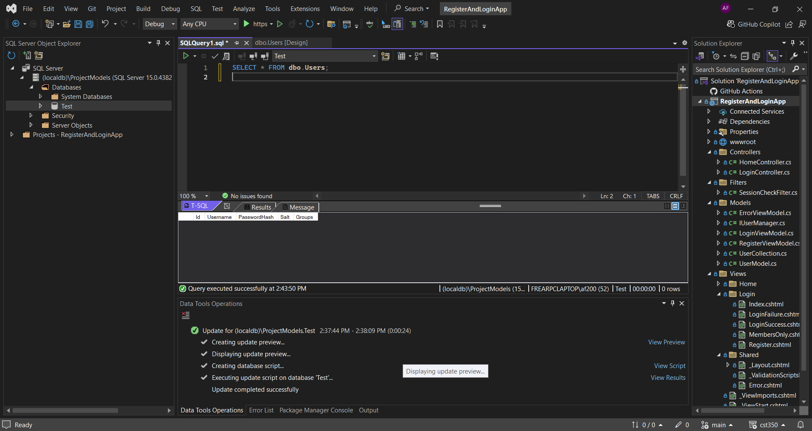
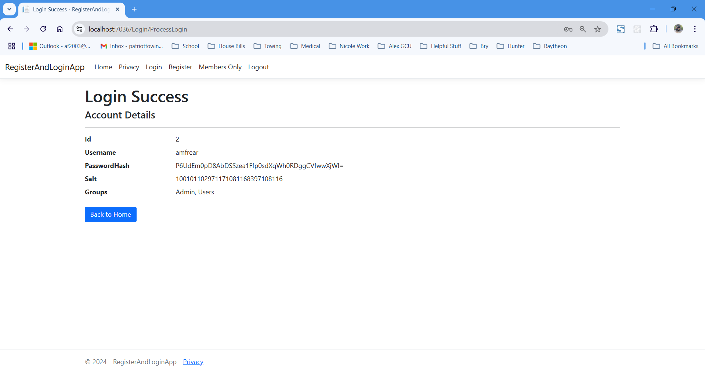
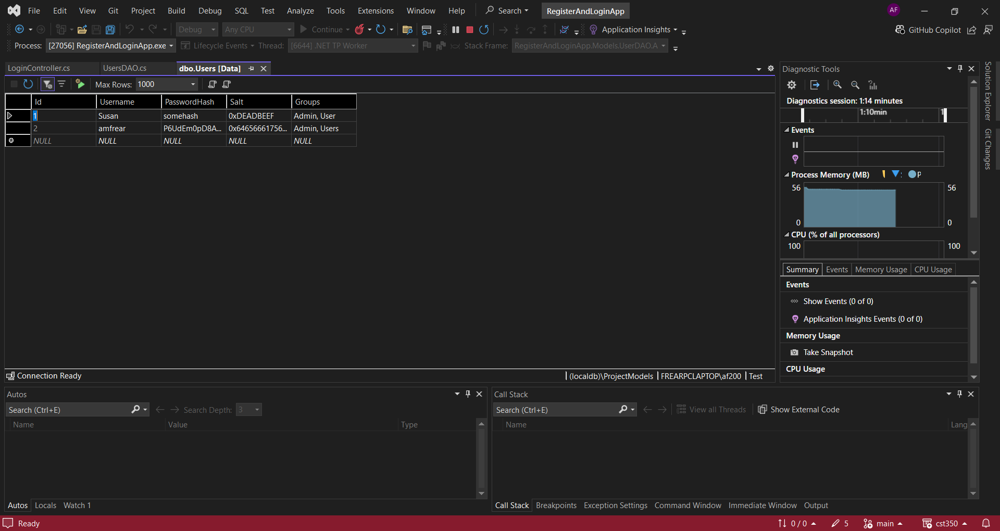
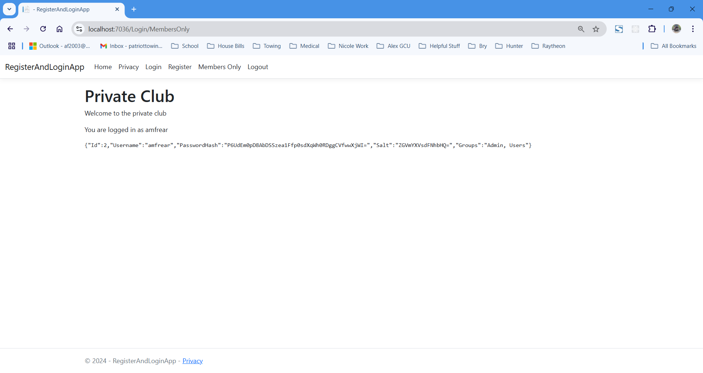
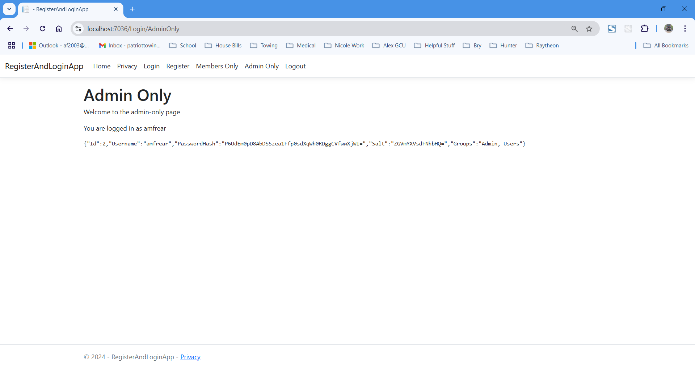
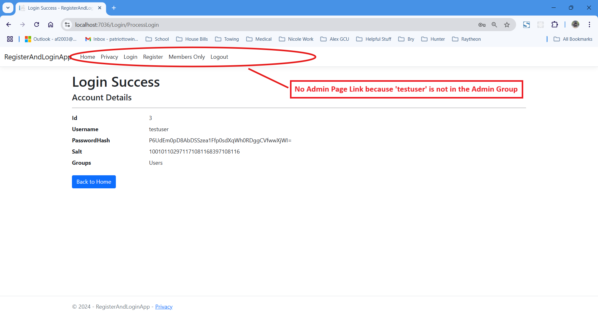

# CST-350 Activity 3 - Database and Users

## Cover Sheet
**Student Name:** Alex Frear  
**Date:** 11/6/2024  
**Program:** College of Science, Engineering, and Technology, Grand Canyon University  
**Course:** CST-350 Programming in C# III  
**Instructor:** Brandon Bass  

---

## Part 1: Database Setup and Integration Overview
- **This section demonstrates the steps taken to set up a `Users` table in the database, add a new user, and validate the registration and login functionalities.**

### 1. Users Table Creation

*The screenshot shows the `Users` table created in SQL Server with fields for `Id`, `Username`, `PasswordHash`, `Salt`, and `Groups`, as part of the database setup.*

### 2. Users Table Data Insertion

*This screenshot displays the insertion of a new user into the `Users` table, populating fields such as `Username`, `PasswordHash`, `Salt`, and `Groups`.*

### 3. Users Table Data Validation

*Here, we see the validation step where the `SELECT * FROM dbo.Users` query confirms that the user data is successfully saved in the database.*

### 4. New Registered User - Login Success

*The screenshot shows a successful login by the newly registered user, displaying account details, including `Username`, `PasswordHash`, `Salt`, and `Groups`.*

### 5. New Registered User in Database

*The new user entry is verified within the database, showing that the registration functionality successfully added the user details to the `Users` table.*

### 6. Members Only Page Access by New User

*This screenshot demonstrates that the newly registered user has successfully accessed the Members-Only page, confirming the session validation and restricted access.*

---

## Summary of Key Concepts (Part 1)
In Part 1 of this activity, I integrated the login and registration system with a SQL Server database. This involved setting up a `Users` table in SQL Server to securely store user data, implementing SQL commands in C# for data insertion and validation, and developing a registration and login system with password hashing and salting to enhance security. Additionally, I created a Members-Only page that uses session-based access control to restrict access to authenticated users only. Through these tasks, I gained practical experience in managing user data within a database and enforcing authentication requirements for protected pages.  

---

## Part 2: User Group Access

- **This section demonstrates the steps taken to restrict access to an Admin-Only page for users with `Admin` group access.**

### 7. Admin Only Page

*The screenshot shows the Admin-Only page, which is accessible only to users who belong to the `Admin` group, demonstrating group-based access control.*

### 8. User Only Access Restriction

*This screenshot demonstrates that a regular user, who is not part of the `Admin` group, is restricted from accessing the Admin-Only page, ensuring role-based access.*

---

## Summary of Key Concepts (Part 2)
In Part 2 of this activity, I implemented role-based access control by creating an Admin-Only page that is restricted to users in the `Admin` group. I developed a custom action filter, `AdminCheckFilter`, which verifies the user’s role by checking session data for group membership. This filter redirects non-admin users attempting to access the Admin-Only page back to the login page. Through this process, I learned how to use custom filters to enforce group-specific access restrictions in ASP.NET Core MVC, enhancing both the security and structure of my application.  