# CST-350 Activity 4 - Dependency Injection, Data Validation, and ButtonGrid

## Cover Sheet
**Student Name:** Alex Frear  
**Date:** 11/11/2024  
**Program:** College of Science, Engineering, and Technology, Grand Canyon University  
**Course:** CST-350 Programming in C# III  
**Instructor:** Brandon Bass  

---

## Part 1: Dependency Injection Overview
- **This section demonstrates the implementation of dependency injection in `UserController` to utilize the `IUserManager` interface, allowing for flexibility in selecting different data sources.**

### 1. Configuring Dependency Injection in `UserController`
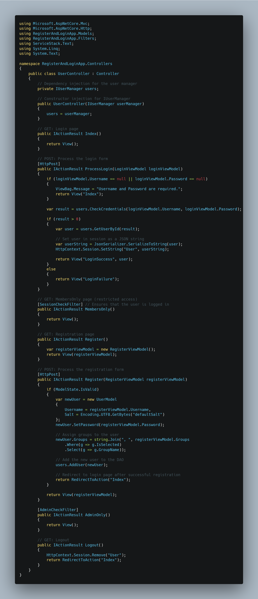

*The `UserController` class is modified to accept an `IUserManager` instance through constructor injection, enabling dependency injection of different user manager classes.*

### 2. Setting Up `UserDAO` Injection in `Program.cs`
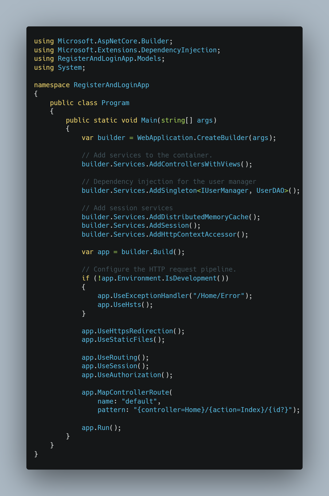

*The initial configuration in `Program.cs` injects `UserDAO` as the implementation of `IUserManager`, using `AddSingleton` to provide a consistent instance across the application.*

### 3. Testing with SQL-Backed Data Source
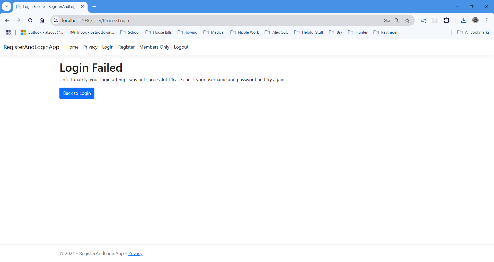
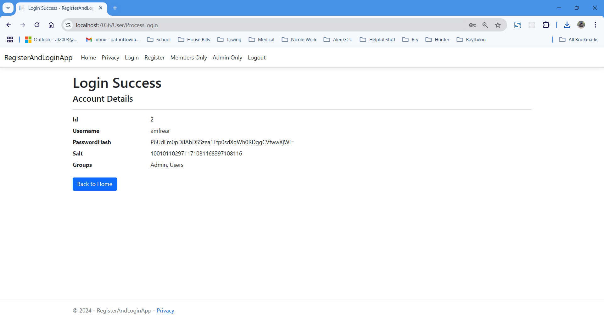

*Initially, the application uses `UserDAO`, allowing login attempts against users stored in the SQL database. The application shows both successful and failed login attempts depending on user credentials.*

### 4. Switching to `UserCollection` for In-Memory Data
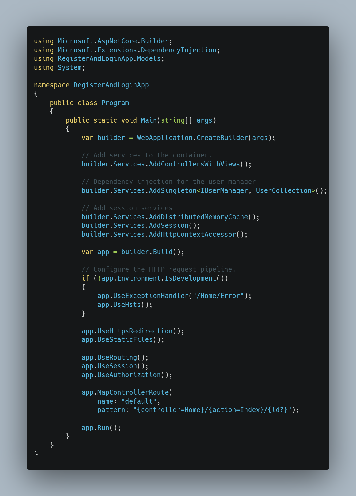

*The dependency injection configuration in `Program.cs` is updated to inject `UserCollection` as the `IUserManager` implementation, switching the data source to an in-memory collection of users.*

### 5. Testing with In-Memory Data Source

*With `UserCollection` injected, the application allows login with in-memory data (e.g., the user "Harry"), showcasing dependency injection's flexibility by switching data sources without modifying the `UserController`.*

---

## Summary of Key Concepts (Part 1)
In Part 1 of Activity 4, I implemented dependency injection in the `UserController` class, allowing for flexible selection between data sources (`UserDAO` for SQL and `UserCollection` for in-memory data). By configuring `Program.cs` to inject `IUserManager` with either `UserDAO` or `UserCollection`, I demonstrated how dependency injection decouples the controller from a specific data implementation. This setup enabled easy data source switching and provided a practical understanding of dependency injection, enhancing the application's modularity and testability. 

---

## Part 2: Data Validation and Form Enhancements

- **This section demonstrates the addition of validation rules, new address fields, and custom display names in the `AppointmentModel` to meet specified requirements.**

### 1. Initial Validation Errors for Empty Fields

*The form displays initial validation errors for required fields, ensuring that no field is left blank.*

### 2. Custom Labels and Validation Errors

*The appointment form shows customized labels for each field and displays validation error messages when fields are left empty.*

### 3. Additional Validation Rules
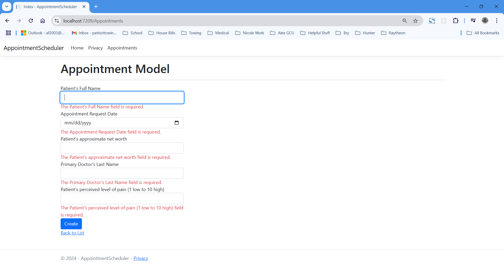

*This screenshot shows the form with additional validation rules for net worth and pain level. Errors are shown if the net worth is below $90,000 or the pain level is 5 or below, in line with the business requirements.*

### 4. Successful Submission Displaying Appointment Details

*The final appointment details are displayed, showing a successful submission with all required information and restrictions met.*

### 5. Validation Errors for Added Fields and Restrictions
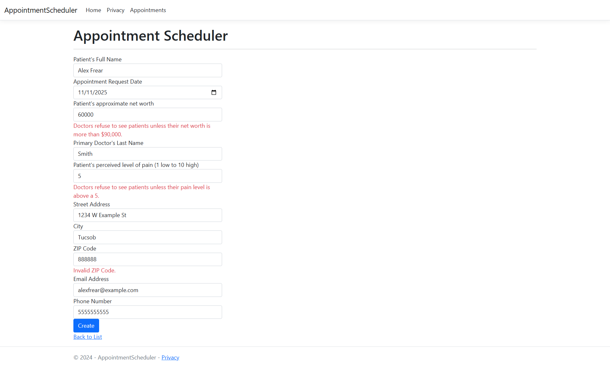

*This screenshot demonstrates validation errors for new fields (such as ZIP code, email, and phone number) and specific restrictions on net worth and pain level.*

### 6. Successful Submission with New Fields and Restrictions
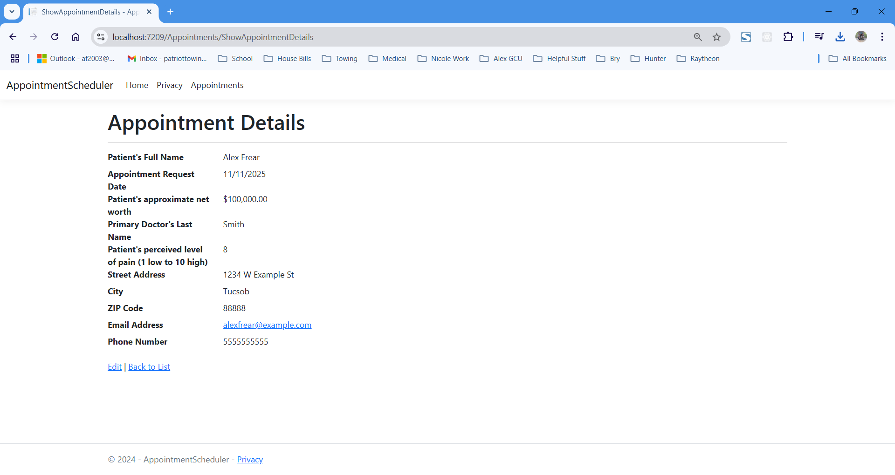

*After filling in all required fields correctly, the form successfully submits, and the appointment details are displayed, including the new address fields and validation-compliant values.*

---

## Summary of Key Concepts (Part 2)
In Part 2 of Activity 4, I implemented additional validation rules in the `AppointmentModel` to ensure data integrity and enforce business logic. Custom display names were added to enhance form readability, and new fields for address, email, and phone were included. The model was further enhanced to reject appointments if the patient's net worth is below $90,000 or if the pain level is 5 or lower, as per the specified requirements. This part of the activity provided experience in creating custom validation messages, expanding form fields, and applying business rules to data entry.

---

## Part 3: Button Grid Game Implementation with Success Message

- **This section demonstrates the creation of a button grid that changes state upon clicks. The goal is to have all buttons in the same color, at which point a success message is displayed.**

### 1. Setting up the Button Grid with Initial State
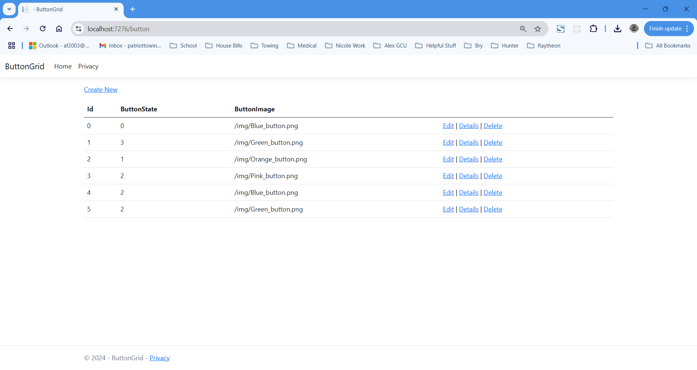

*The initial setup of the button grid displays each button with its unique `Id`, `ButtonState`, and corresponding image based on its color.*

### 2. Displaying the Button Grid with Timestamp
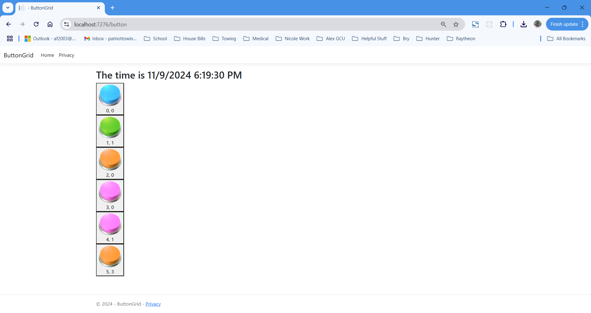

*The grid view displays a live timestamp, providing a dynamic element to the page along with the clickable buttons.*

### 3. Applying Flexbox for Grid Layout
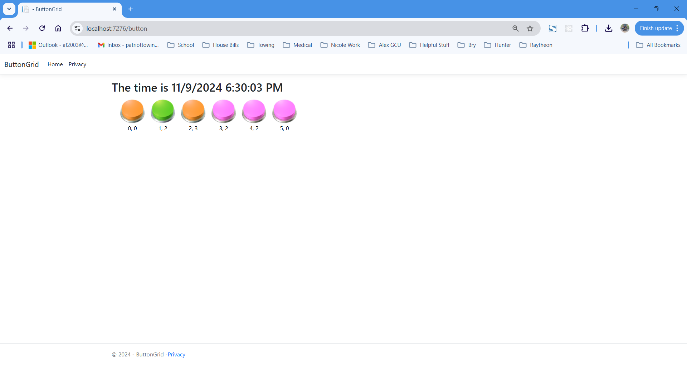

*The button grid layout is enhanced using Flexbox, ensuring the buttons are aligned in rows. CSS styling is applied to improve visual consistency and spacing.*

### 4. Inspecting HTML Elements
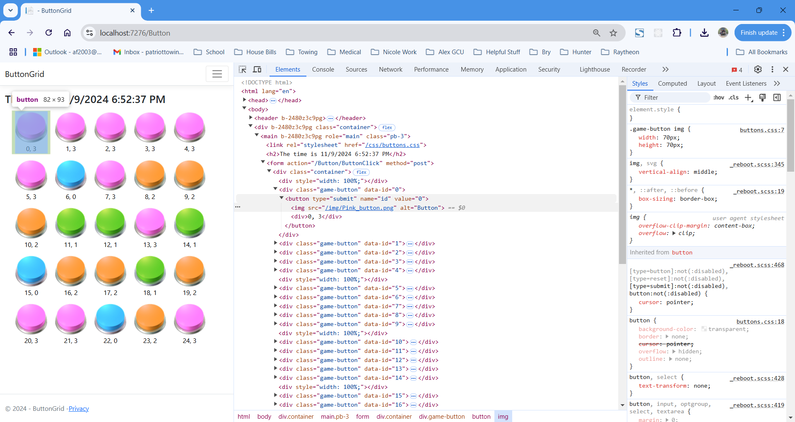

*The HTML generated by the Razor view is inspected to confirm each button’s structure, attributes, and functionality.*

### 5. Game Success Message Display
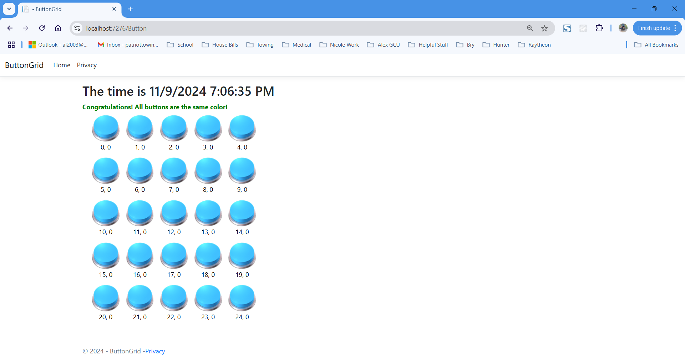

*Once all buttons in the grid are set to the same color, a success message is displayed to the user, indicating that the game goal has been achieved.*

---

## Summary of Key Concepts (Part 3)
In Part 3, I created a button grid where each button changes state upon a click, cycling through a set of colors. Using Flexbox for layout ensured that the grid remained visually organized. Additionally, a success message is displayed when all buttons reach the same color, demonstrating simple game logic and enhancing user experience through visual feedback.

---
