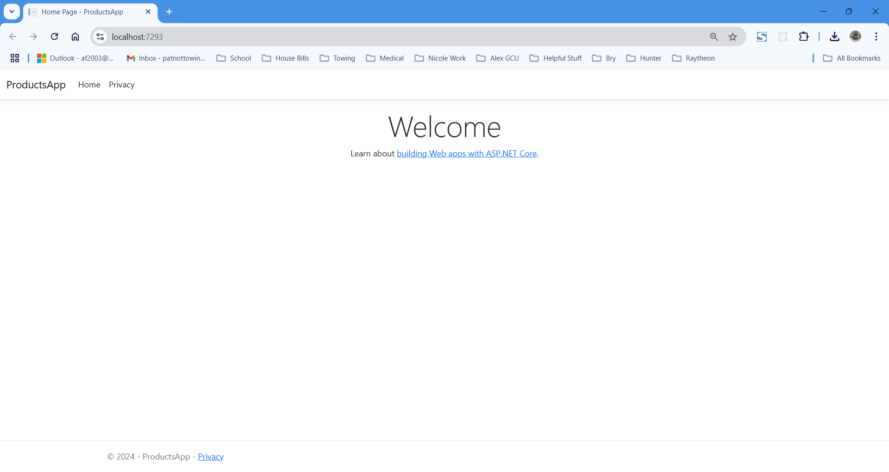
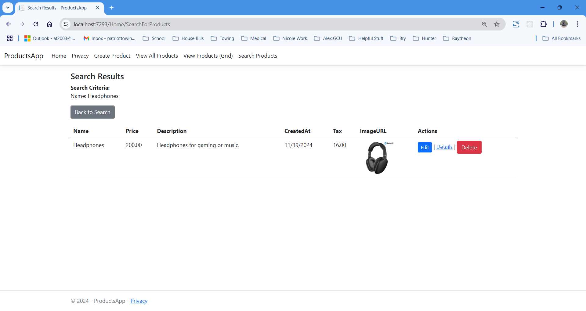

# CST-350 Activity 5 - CRUD with n-Layer Design

## Cover Sheet
**Student Name:** Alex Frear  
**Date:** 11/20/2024  
**Program:** College of Science, Engineering, and Technology, Grand Canyon University  
**Course:** CST-350 Programming in C# III  
**Instructor:** Brandon Bass  

---

## Overview
This activity focuses on building a full-stack CRUD application using the n-layer design approach with ASP.NET MVC. The application includes features such as product creation, updates, deletion, searching, and dynamic configuration using appsettings.json. Below are the detailed steps, implementation screenshots, and key learnings from this activity.

---

## Part 1: Setting up the Database and Application

### 1. Creating the Products Database

*The database schema is set up to store product data, including fields for Name, Price, Description, CreatedAt, and ImageURL.*

### 2. Products Table Schema

*The table schema defines the structure of the Products table with appropriate data types and constraints.*

### 3. ProductModel Class Implementation

*The `ProductModel` class represents the data structure for products in the application.*

### 4. Initial Application Default Page

*The default landing page of the application after initial setup.*

---

## Part 2: Implementing Product Creation

### 1. Homepage Navigation View

*The homepage displays navigation links to access product-related functionalities.*

### 2. Empty Create Product Form

*An empty product creation form is presented to the user, ready for input.*

### 3. Create Product Form Filled with Data

*The product creation form is filled with details for a new product before submission.*

### 4. Updated Products Table After Submission

*The new product is successfully added to the database and displayed in the product table.*

### 5. Initial View of All Products Page

*The "View All Products" page shows a complete list of all available products, including the newly added item.*

---

## Part 3: Adding Dynamic Tax Calculation

### 1. Tax Calculation in Create Product Form

*The tax amount is dynamically calculated based on the entered product price and displayed in real-time.*

### 2. Tax Display on All Products Page

*The calculated tax for each product is displayed alongside other product details.*

### 3. Selecting an Image for a Product

*Users can select an existing image from a dropdown while creating a new product.*

### 4. Products Displayed with Associated Images

*The product view displays products along with their associated images.*

### 5. Products Displayed with Associated Images in Grid View

*The product grid view displays products along with their associated images.*

---

## Part 4: Editing and Deleting Products

### 1. Edit Product Page with Pre-Filled Data

*The edit product form is pre-populated with existing product data for easy updates.*

### 2. Delete Product Confirmation Dialog

*The user is prompted to confirm the deletion of a specific product.*

### 3. Product Successfully Deleted from Table

*The deleted product is no longer visible on the "View All Products" page.*

### 4. Product Deletion Reflected in Grid View

*The product grid view confirms the successful deletion of the product.*

---

## Part 5: Searching for Products

### 1. Product Search Input Page

*The search input page allows users to search for products by name or description.*

### 2. Search Results Display

*The search results page displays products that match the search criteria entered by the user.*

---

## Part 6: Viewing Product Details

### 1. Detailed View of a Single Product

*The product details page provides in-depth information about a selected product, including its image, price, tax, description, and creation date.*

---

## Part 7: Centralized Configuration with appsettings.json

### 1. Configuration Settings in appsettings.json

*The `appsettings.json` file centralizes important configuration settings such as the database connection string and tax rate, enabling dynamic updates without requiring recompilation.*

---

## Summary of Key Concepts
Through Activity 5, I gained valuable hands-on experience in building a full-stack CRUD application using the n-layer design approach. This activity reinforced the importance of **separation of concerns**, where the application was divided into distinct layers to ensure modularity and maintainability. I also learned the practical benefits of **dependency injection**, which allowed me to decouple components, promoting both flexibility and testability in the application.

A significant takeaway was the use of **dynamic configuration** through the `appsettings.json` file, which centralized important settings like database connection strings and tax rates. This approach made it easier to update configurations dynamically and adapt to different environments without recompiling the application. The implementation of **CRUD operations**—creating, reading, updating, and deleting data—provided me with a solid understanding of essential functionality in data-driven applications.

Additionally, I focused on **UI enhancements** to improve the user experience. Features like dynamic tax calculation, image selection for products, and detailed product views added a level of polish and usability to the application. Overall, this project highlighted the importance of structured application design, preparing me to develop scalable, maintainable, and user-friendly web applications in the future.
