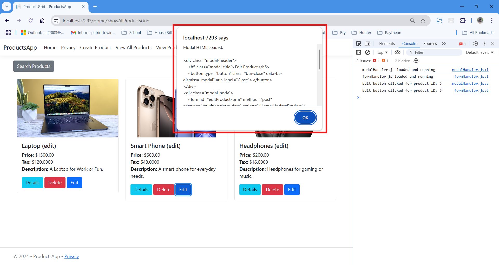
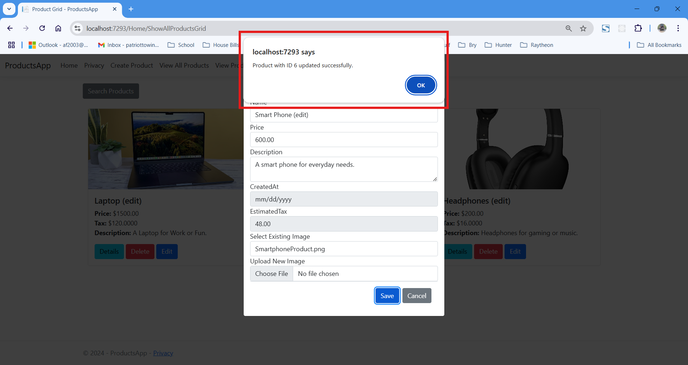

# CST-350 Activity 6 - Partial View

## Cover Sheet
**Student Name:** Alex Frear  
**Date:** 11/27/2024  
**Program:** College of Science, Engineering, and Technology, Grand Canyon University  
**Course:** CST-350 Programming in C# III  
**Instructor:** Brandon Bass  

---

## Part 1: AJAX-Based Modal and Form Handling
- **This section demonstrates the implementation of an AJAX-based workflow for editing products. The process involves dynamically loading a modal form, handling form submissions via AJAX, and updating the product grid without a full-page refresh.**

### 1. Modal Loaded with Product Details
The modal is dynamically populated with the product’s details for editing after a successful AJAX request.

*The modal displays the current details of the product being edited.*

### 2. Edit Button Trigger
When the "Edit" button is clicked, a debug alert is displayed, and the AJAX request to load the modal is initiated.

*The debug alert shows the product ID associated with the clicked Edit button.*

### 3. Modal HTML Debug Alert
A debug alert shows the HTML content loaded into the modal, confirming successful loading of the modal’s form.

*The debug alert displays the HTML structure of the modal content.*

### 4. AJAX Form Submission Triggered
When the "Save" button in the modal is clicked, the form submission is intercepted by JavaScript, and a debug alert confirms AJAX handling.

*The debug alert indicates that the form is being submitted via AJAX rather than the default form submission.*

### 5. Product Update Success
Once the AJAX request completes, a debug alert confirms the successful update of the product.

*The debug alert shows the product ID of the successfully updated product.*

### 6. Updated Product Card HTML Debug
The final debug alert shows the HTML of the updated product card, confirming the successful update without a full-page refresh.

*The debug alert displays the updated HTML content for the product card.*

---

## Summary of Key Concepts (Part 1)
In this part of Activity 6, I learned how to implement an AJAX-based workflow for editing products dynamically. I used JavaScript to load modal content asynchronously and intercept form submissions, enabling smoother user interactions. Debug alerts and logs were invaluable tools for ensuring each step of the process worked as intended. This approach allowed me to update the product grid seamlessly without a full-page refresh, improving both responsiveness and user experience. This activity reinforced my understanding of how AJAX and JavaScript can enhance modern web applications.

---

## Part 2: Partial View and AJAX Implementation
- **This section demonstrates the implementation of partial views and AJAX for dynamically updating individual buttons in a button grid. Debug alerts were utilized to confirm the functionality at each step of the process.**

### 1. Testing the Partial View in Isolation
To ensure the `_Button` partial view works independently, the `PartialPageUpdate` method was tested directly. The resulting view displays the rendered HTML for a single button.

*This confirms that the `_Button` partial view renders correctly when tested through the `PartialPageUpdate` method.*

### 2. Initial Button Grid Display
The initial button grid is displayed, showing buttons in their starting states with unique IDs and colors.

*The grid displays buttons with IDs ranging from 0 to 24, each initialized with its own state and color.*

### 3. Button Update After AJAX
The clicked button (Button 0) updates dynamically after the server returns the rendered partial view, without refreshing the entire page.

*The updated button (Button 0) reflects its new state and color, confirming that the partial view was correctly applied to the button element.*

### 4. AJAX Button Click Event Handling
When a button is clicked, a debug alert confirms that the event is being handled by JavaScript via AJAX instead of the default form submission.

*The debug alert shows the ID of the clicked button and confirms the use of AJAX for handling the click event.*

### 5. HTML Returned by the Server
After the AJAX request is sent, a debug alert displays the HTML returned by the server for the clicked button. This confirms that the `_Button` partial view is being rendered correctly.

*The debug alert provides the raw HTML returned from the server for the updated button, including its new state and image source.*

---

## Summary of Key Concepts (Part 2)
In this part of Activity 6, I learned how to use partial views and AJAX to dynamically update individual elements in a grid without a full-page refresh. By splitting the button logic into a reusable `_Button` partial view, I was able to simplify and modularize the button rendering process. The use of AJAX allowed for seamless updates, improving user experience by reducing page load times. Debug alerts provided valuable insights into each step, ensuring the correct flow of data between the client and server.
