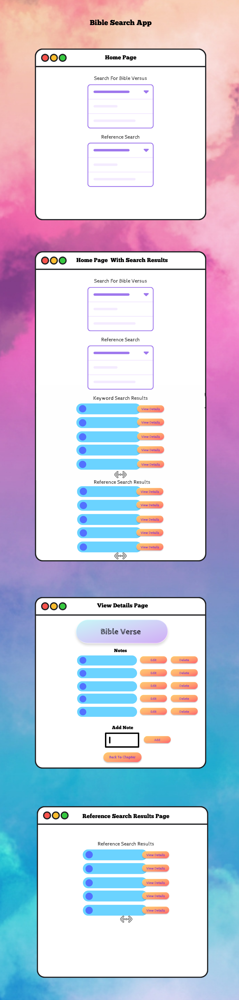

# Benchmark - Activity 8 Bible Verse Application

## Cover Sheet
**Student Name:** Alex Frear  
**Date:** 12/13/2024  
**Program:** College of Science, Engineering, and Technology, Grand Canyon University  
**Course:** CST-350 Programming in C# III  
**Instructor:** Brandon Bass  

---

## Part 1: Design Documents
- **This section demonstrates the design and planning process, showcasing the UML diagram, wireframes, and ER diagram. Each element highlights the structure and intended functionality of the application.**

### 1. UML Diagram
The UML diagram illustrates the structure of the application, including classes, properties, and methods.

*The application structure is well-defined through this UML diagram.*

### 2. Wireframes
The wireframes represent the user interface design for the application.

*The user interface plan provides a clear vision of the layout and navigation.*

### 3. ER Diagram
The ER diagram outlines the database structure, showing relationships between tables (`asv_books`, `asv_verses`, and `notes`).

*The ER diagram defines database relationships clearly.*

---

## Part 2: Application Screenshots
- **This section provides screenshots of the application's functionality, with captions explaining each step of the user experience.**

### 1. Home Page (Initial View)
**Description:** Displays options for keyword-based and reference-based searches.

*The initial view offers intuitive navigation for users.*

### 2. Home Page with Keyword Search Results
**Description:** Displays search results when a keyword is entered.

*Search results are displayed dynamically based on the keyword.*

### 3. Home Page with Reference Search Results
**Description:** Displays results for a reference-based search by book and chapter.

*Reference-based searches return accurate chapter results.*

### 4. Home Page with Combined Search Results
**Description:** Displays results for both keyword and reference-based searches together.

*Combined results enhance user search capabilities.*

### 5. View Details Page (Initial View)
**Description:** Displays details for a selected Bible verse along with its associated notes.

*Verse details are presented clearly for user review.*

### 6. Adding a Note
**Description:** Allows a user to add a note for a specific verse.

*Users can annotate verses with personal notes.*

### 7. Editing a Note
**Description:** Displays the edit note functionality.

*Users can easily edit existing notes.*

### 8. Deleting a Note
**Description:** Demonstrates deleting an existing note.

*Note deletion functionality is intuitive and efficient.*

### 9. Reference Search Results Page: Back to Chapter Button
**Description:** Highlights the "Back to Chapter" button functionality.

*Users can return to the chapter with a single click.*

### 10. AJAX Functionality for Search Results
**Description:** Developer tools showing AJAX during a search query.

*AJAX enables smooth, asynchronous search updates.*

### 11. AJAX for Adding Notes
**Description:** AJAX functionality during note addition.

*Notes are added dynamically without refreshing the page.*

### 12. AJAX for Editing Notes
**Description:** AJAX functionality during note editing.

*Edit updates are reflected instantly through AJAX.*

### 13. AJAX for Deleting Notes
**Description:** AJAX functionality during note deletion.

*Notes are removed seamlessly using AJAX.*

---

## Part 3: Summary of Key Concepts
- **This section reflects on the key software development principles and skills learned during the project.**

### Application Design and Development
Developing the BibleSearchApp deepened my understanding of the Model-View-Controller (MVC) architecture, separating concerns between models, views, and controllers. Modeling database relationships allowed efficient storage and retrieval of Bible-related data, such as books, verses, and notes.

### AJAX Integration
One of the most rewarding aspects was implementing AJAX for dynamic features like search results and note management. This made the application more responsive and user-friendly by reducing page reloads.

### Purpose and Impact
The BibleSearchApp aims to provide a user-friendly tool for studying scripture. By enabling keyword and reference searches, along with note-taking capabilities, it enhances personal study and group discussions. The project’s focus on usability ensures it meets real-world needs effectively.

*This project strengthened my skills in database design, MVC architecture, and AJAX-based client-server communication while contributing to an impactful tool for the Christian community.*

---
