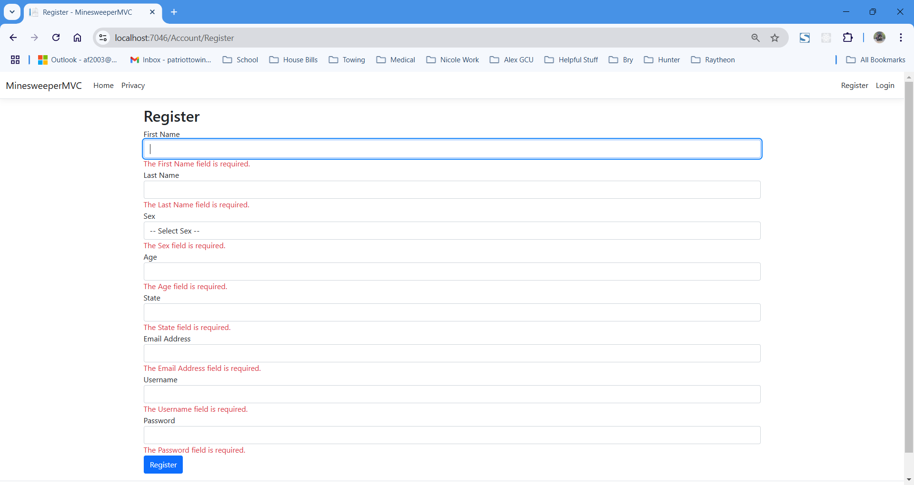
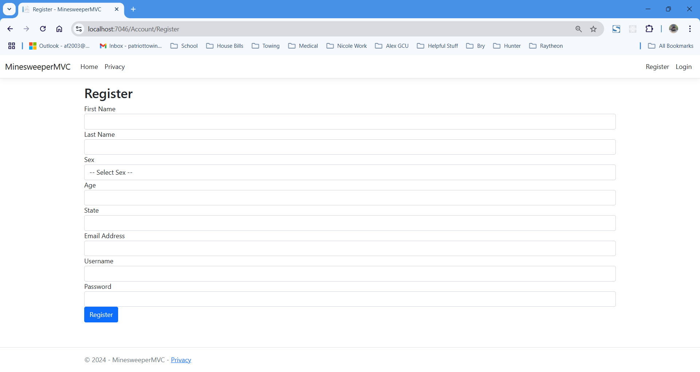
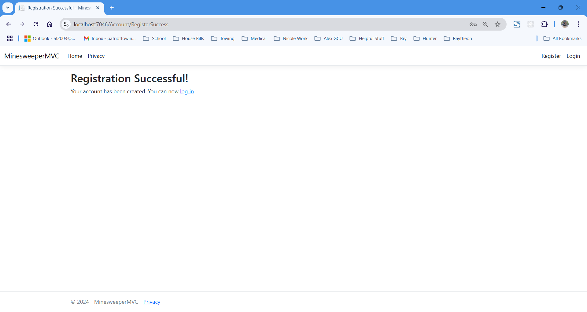
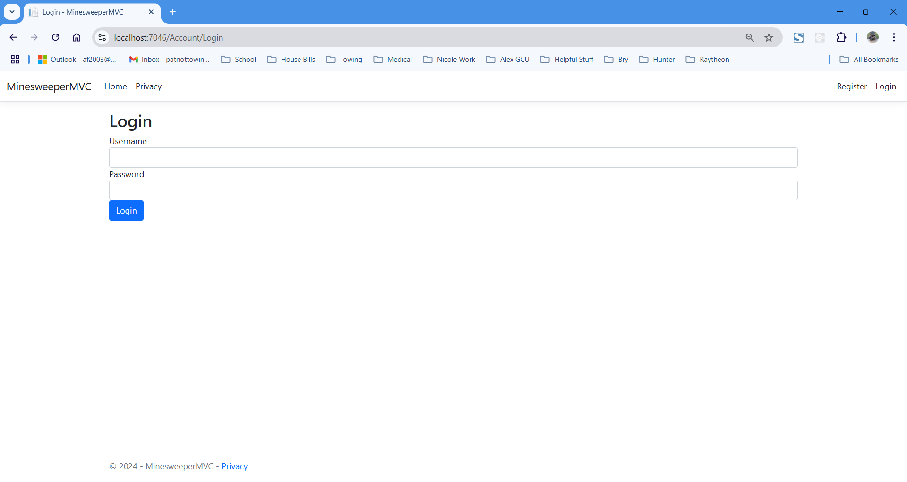
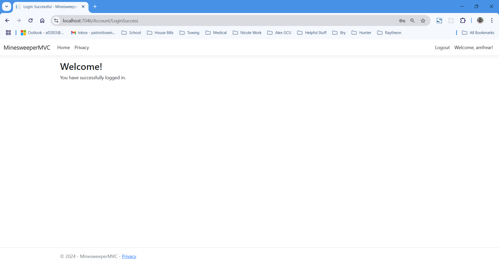
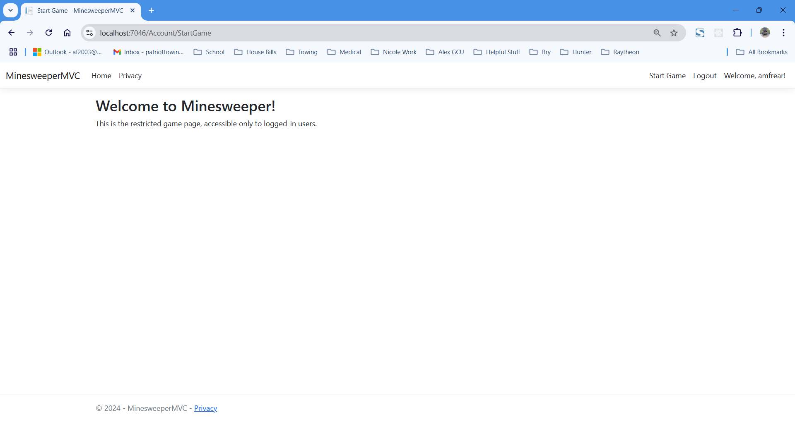

# CST-350 Milestone 1 - Login and Registration Modules

## Cover Sheet
**Student Name:** Alex Frear  
**Date:** 11/02/2024  
**Program:** College of Science, Engineering, and Technology, Grand Canyon University  
**Course:** CST-350 Programming in C# III  
**Instructor:** Brandon Bass  

## Screencast Video

    <a href="https://www.loom.com/share/9be9cb9eda3245258c0205d148a190e1" target="_blank">
      
CST 350 - Milestone 1 Login and Registration Modules - Watch Video

    </a>
    

## Application Overview

- **Below are screenshots demonstrating the different steps and pages created as part of Milestone 1 - MinesweeperMVC Application.**

### 1. Registration Page with Validation

*This screenshot shows the Registration page with all form fields requiring validation. The user must enter a valid First Name, Last Name, Sex, Age, State, Email Address, Username, and Password to register.*

### 2. Registration Form (Empty)

*This shows the initial view of the Registration page when the user first accesses it.*

### 3. Registration Success

*This screenshot shows the Registration Success page, confirming that the account was successfully created.*

### 4. Login Page

*The Login page is used by users to authenticate and access the application using their Username and Password.*

### 5. Login Success Page

*This screenshot shows the Login Success page that the user is redirected to after a successful login.*

### 6. Start Game Page (Restricted Access)

*This screenshot shows the "Start Game" page. It is only accessible to users who are logged in. Here, the user can proceed to play Minesweeper after logging in.*

### Summary of Key Concepts
In Milestone 1, we built the foundational components of the MinesweeperMVC application using ASP.NET Core MVC. Key concepts demonstrated include:
- **Registration and Login Functionality:** Implemented a user registration form with input validation and a login system using ASP.NET Identity.
- **Session Management:** Managed user sessions with ASP.NET Core, allowing restricted access to certain pages, such as the "Start Game" page.
- **MVC Architecture:** The application followed the MVC (Model-View-Controller) architecture, allowing separation of concerns between data, user interface, and application logic.
- **Routing and Navigation:** Extended the navigation bar to include "Register," "Login," "Logout," and "Start Game" links, providing easy navigation between the core features.
- **View Rendering and Data Transfer:** Used ViewData to pass information between controllers and views, ensuring that user actions and page transitions provided a smooth experience.

This milestone emphasized user management and authentication features, setting the stage for the core Minesweeper gameplay features in the following milestones.
