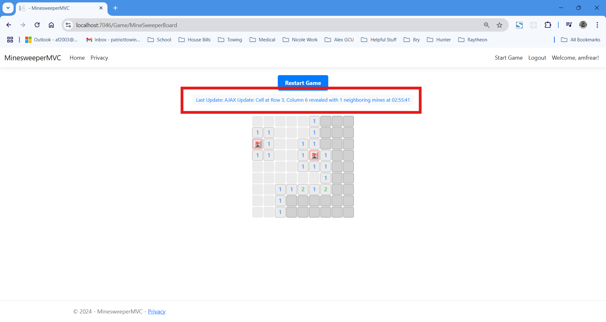

# CST-350 Milestone 3 - Partial Page Updates

## Cover Sheet
**Student Name:** Alex Frear  
**Date:** 11/29/2024  
**Program:** College of Science, Engineering, and Technology, Grand Canyon University  
**Course:** CST-350 Programming in C# III  
**Instructor:** Brandon Bass  

## Screencast Videos

    <a href="https://www.loom.com/share/c2a24c3efce24cd8a9eb7248ac548b91?sid=f21b8515-10a4-49ad-9a5b-cba81f1ba3f2">
      
CST350 - Milestone 3 - MinesweeperMVC Code Review - Watch Video

    </a>

    <a href="https://www.loom.com/share/4752c9b4eafa455c9046dc546ea962e5?sid=8ada176b-4c62-4b4d-ac0e-319e202ba627">
      
CST350 - Milestone 3 - MinesweeperMVC App Running - Watch Video

    </a>

## Application Overview

- **Below are screenshots demonstrating the features implemented as part of Milestone 3 - MinesweeperMVC Application.**

---

### 1. Initial Game Board State

*This screenshot shows the initial game board state, ready for user interaction.*

---

### 2. Partial Update - Left Click (AJAX Floodfill)

*This screenshot demonstrates AJAX dynamically updating the board after a left click that triggered a flood-fill operation.*

---

### 3. Partial Update - Right Click (AJAX and Flagged Cell)

*This screenshot shows AJAX dynamically updating the game board after a right-click action to flag a cell.*

---

### 4. Partial Update - Left Click (Neighboring Mines)

*This screenshot shows the board updated dynamically using AJAX after a left-click action revealed a cell with neighboring mines.*

---

### 5. Timestamp Demonstration

*This screenshot highlights the dynamically updated timestamp after a left-click action, showing that AJAX is being utilized.*

---

### 6. Left Click Prevention on Flagged Cell

*This screenshot demonstrates that flagged cells do not respond to left-click actions, ensuring proper gameplay logic.*

---

### 7. Game Logic - Loss

*This screenshot shows the Loss message displayed when a mine is clicked. The board reveals all mines as part of the loss condition.*

---

### 8. Game Logic - Win

*This screenshot shows the Win message displayed when the player clears all safe cells. The score and time taken are dynamically calculated.*

---

## Summary of Key Concepts

In Milestone 3, I enhanced the MinesweeperMVC application by incorporating **AJAX for Partial Page Updates** to create a more dynamic and seamless user experience. This allowed me to update only specific parts of the game board, such as individual cells and timestamps, without requiring a full page reload. 

I implemented **Right-Click Flagging** functionality using JavaScript, enabling users to toggle flags on cells. This feature was designed to ensure flagged cells are excluded from left-click actions, maintaining the integrity of the gameplay. Additionally, I encapsulated the game state logic in a backend service to accurately handle win and loss conditions, ensuring proper functionality and dynamic message displays.

Through this milestone, I focused on creating a responsive and interactive UI by leveraging the MVC architecture and integrating AJAX and JavaScript effectively. These enhancements helped me improve the user experience and demonstrated my ability to implement advanced features within an ASP.NET Core application. This project has provided me with a solid understanding of partial page updates, user interaction handling, and dynamic content rendering, paving the way for future improvements like saving game progress and adding more advanced functionality.
