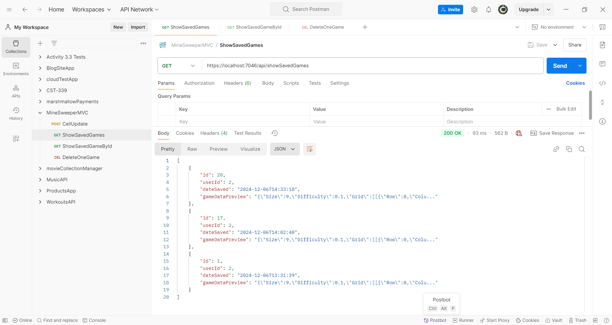

# CST-350 Milestone 4 - Save/Restore Game Progress and REST API Features

## Cover Sheet
**Student Name:** Alex Frear  
**Date:** 12/06/2024  
**Program:** College of Science, Engineering, and Technology, Grand Canyon University  
**Course:** CST-350 Programming in C# III  
**Instructor:** Brandon Bass  

## Screencast Videos

    <a href="https://www.loom.com/share/338e115b93e14562b7bf6bf70231afa3">
      
CST350 - Milestone 4 - Code Review - Watch Video

    </a>
    
  

    <a href="https://www.loom.com/share/2e09d228753c468a8e7de6b41a06f016">
      
CST350 -Milestone 4 - Application Running - Watch Video

    </a>
    
  

---

## Application Overview

- **Below are screenshots demonstrating the features implemented as part of Milestone 4 - Save/Restore Game Progress and REST API Features.**

---

### 1. Database Table - Games

*This screenshot shows the `Games` table in the database, which stores the game state, user ID, date saved, and serialized game data.*

---

### 2. Initial Game State

*This screenshot displays the initial game board state before saving progress.*

---

### 3. Game Saved Successfully

*This screenshot demonstrates a successful game save operation. The game state is serialized and stored in the database.*

---

### 4. Saved Games Page Updated

*This screenshot shows the `Saved Games` page updated with the newly saved game.*

---

### 5. Load Game Confirmation

*This screenshot shows the confirmation dialog displayed when the user selects a saved game to load.*

---

### 6. Loading a Game

*This screenshot demonstrates the successful loading of a previously saved game.*

---

### 7. Updating a Saved Game

*This screenshot shows the functionality of updating the same saved game to reflect the latest state.*

---

### 8. Deleting a Saved Game

*This screenshot shows the confirmation message after a user selects a saved game for deletion.*

---

### 9. Saved Games Page Updated After Deletion

*This screenshot shows the `Saved Games` page updated after a game was deleted.*

---

### 10. REST API - List All Saved Games

*This screenshot shows the REST API endpoint `localhost/api/showSavedGames`, which lists all saved games.*

---

### 11. REST API - Retrieve a Single Game by ID

*This screenshot shows the REST API endpoint `localhost/api/showSavedGames/{id}`, which retrieves a single saved game by its ID.*

---

### 12. REST API - Delete a Specific Game

*This screenshot shows the REST API endpoint `localhost/api/deleteOneGame/{id}`, which deletes a specific saved game.*

---

### 13. Verification After Deletion

*This screenshot confirms the successful deletion of a saved game via the REST API.*

---

## Summary of Key Concepts

In Milestone 4, I focused on enhancing the MinesweeperMVC application by implementing features for saving and restoring game progress, along with REST API functionality. I added a "Save Game" button that serializes the game state, including the game board and user information, and stores it in a database. Additionally, I created a user-friendly interface that allows users to view, load, or delete saved games. On the backend, I developed RESTful API endpoints to list all saved games, retrieve specific games by ID, and delete games from the database. These enhancements allowed me to integrate data serialization, database operations, and REST API development into a single cohesive project. This milestone not only helped me solidify my understanding of these core concepts but also gave me valuable hands-on experience in building dynamic applications with robust backend services in ASP.NET Core.

---
